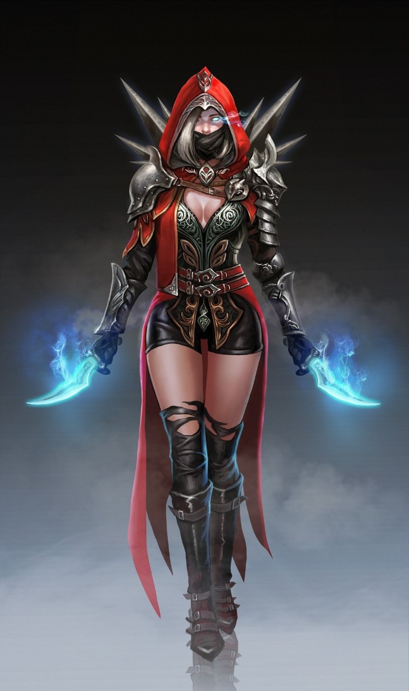

  

<h1 align="center">
  <b>Elizabeth Bot</b>
</h1>

# Functions [Elaborate]
 Best Group Management Bot. This Bot is Anime theme Based Group Management Bot that os developed under the base reports of @MissRose_Bot on TeleGram. 
📝-> Having Lots of Functions.

# <b>Deploy On Heroku.</b>

